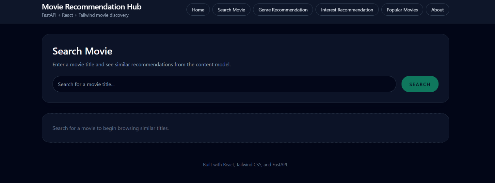
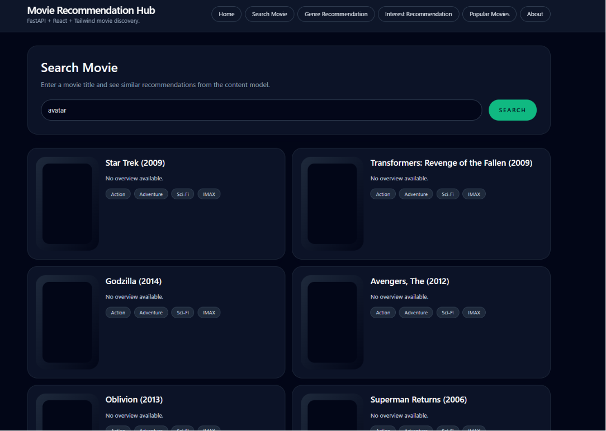
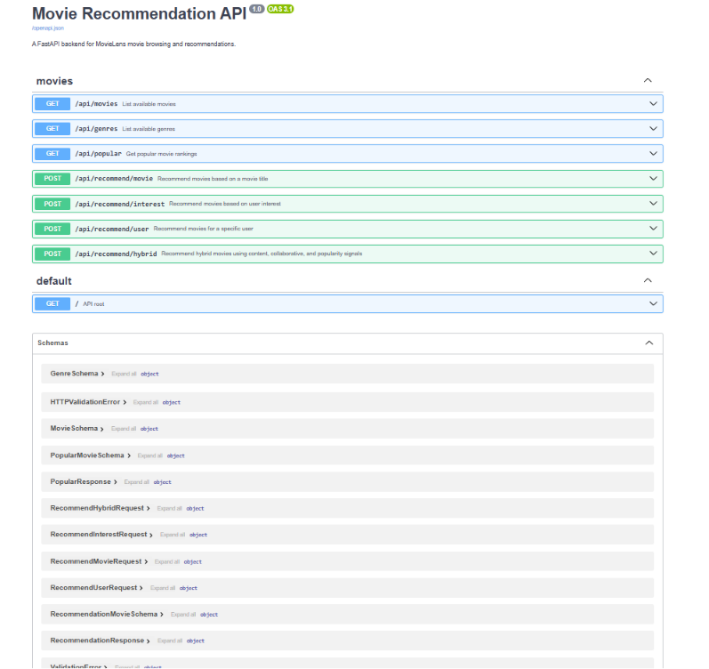
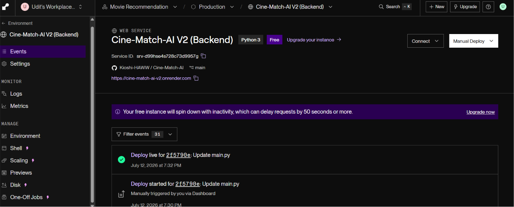
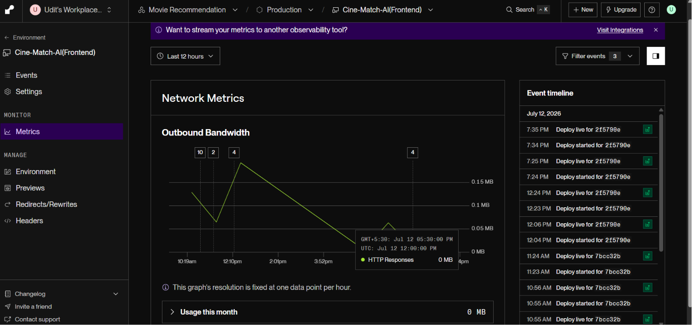

# 🎬 CineMatch AI - Movie Recommendation System


An AI-powered hybrid movie recommendation system built using **FastAPI**, **React**, **MovieLens Dataset**, and **Machine Learning**.

The system combines **Content-Based Filtering**, **Collaborative Filtering**, and **Popularity-Based Recommendations** to provide personalized movie suggestions.

---

# 🚀 Live Demo

### 🌐 Frontend
**https://cine-match-ai-frontend.onrender.com**

### ⚡ Backend API
**https://cine-match-ai-v2.onrender.com**

### 📚 API Documentation
**https://cine-match-ai-v2.onrender.com/docs**

---

# 📸 Project Screenshots

## 🏠 Frontend



---

## 🎯 Recommendation Results



---

## ⚙️ Backend API (Swagger)



---

## ☁️ Backend on Render



---

## 🌍 Frontend on Render



---

# ✨ Features

- 🎬 Content-Based Movie Recommendations
- 🤝 Collaborative Filtering (SVD, NMF, KNN)
- ⭐ Popular Movie Fallback System
- 📝 TF-IDF Based Interest Search
- 🖼️ Movie Posters Support
- 📖 Movie Overview Support
- ⚡ FastAPI REST API
- 🎨 React Frontend
- ☁️ Fully Deployed on Render
- 📚 Interactive Swagger Documentation

---

# 📂 Project Structure

```
Cine-Match-AI
│
├── app/
│   ├── api/
│   ├── models/
│   ├── services/
│   └── main.py
│
├── frontend/
│   ├── src/
│   └── public/
│
├── archive/
│   └── ml-latest-small/
│
├── trained_models/
│
├── requirements.txt
├── render.yaml
└── README.md
```

---

# 🧠 Recommendation Models

### Content-Based Filtering

Uses:

- Movie Genres
- TF-IDF Vectorization
- Cosine Similarity

Recommend movies based on user interests like:

```
Adventure
Sci-Fi
Fantasy
Action
Comedy
```

---

### Collaborative Filtering

Implemented using **scikit-surprise**

Available Models:

- SVD
- NMF
- KNNBasic

Predicts movies users may enjoy based on historical ratings.

---

### Hybrid Recommendation

Combines

- Content Similarity
- Collaborative Filtering
- Popularity Ranking

for better recommendation quality.

---

# 📦 Dataset

Uses the **MovieLens Small Dataset**

Included files:

```
movies.csv
ratings.csv
tags.csv
links.csv
```

Optionally supports a TMDb/IMDb-style metadata CSV. Place it beside the MovieLens files or in an `archive/ml-latest-small/tmdb/` folder as:

```
movies_metadata.csv
```

The backend joins MovieLens `links.csv` (`movieId`/`tmdbId`) to metadata `id`, `tmdbId`, or `tmdb_id` and returns enriched recommendation fields:

- Movie Overview
- Poster URL (`poster_path` / `poster_url`)
- Runtime
- Release Date
- TMDb Vote Average
- IMDb ID

For the Kaggle Movies Dataset, copy `movies_metadata.csv` into `archive/ml-latest-small/` or set `DATA_DIR` to a directory containing both MovieLens CSVs and that metadata file. Poster paths are expanded with `https://image.tmdb.org/t/p/w500` by default; override with `TMDB_IMAGE_BASE_URL` if needed.

If metadata CSV poster/overview values are missing, recommendation and popularity API responses also use a best-effort Wikipedia fallback by movie title. This fallback calls the Wikipedia API for only the returned movies, fills missing `overview`, `poster_path`, and `poster_url`, and adds `wikipedia_title` / `wikipedia_url`. Disable it with:

```
ENABLE_WIKIPEDIA_ENRICHMENT=false
```

---

# ⚙️ Installation

Clone the repository

```bash
git clone https://github.com/YOUR_USERNAME/Cine-Match-AI.git

cd Cine-Match-AI
```

Create virtual environment

```bash
python -m venv .venv
```

Activate

Windows

```bash
.venv\Scripts\activate
```

Linux/Mac

```bash
source .venv/bin/activate
```

Install dependencies

```bash
pip install -r requirements.txt
```

---

# ▶️ Usage

Content Recommendation

```bash
python movie.py --interest "science fiction" --top-n 10
```

Collaborative Recommendation

```bash
python movie.py --user-id 1 --model SVD --top-n 10
```

Using Kaggle Metadata

```bash
python movie.py --interest "adventure fantasy" --top-n 10 --kaggle-metadata path/to/movies_metadata.csv
```

---

# 🌐 Render Deployment

This repository includes a complete **render.yaml** configuration for deploying:

- FastAPI Backend
- React Frontend

as independent Render services.

---

## Backend Environment Variables

```
DATA_DIR=archive/ml-latest-small

MODELS_DIR=trained_models

BACKEND_CORS_ORIGINS=https://YOUR-FRONTEND.onrender.com
```

---

## Frontend Environment Variable

```
VITE_API_BASE_URL=https://YOUR-BACKEND.onrender.com/api
```

---

# 🚀 Production Commands

## Backend

Build

```bash
pip install -r requirements.txt

python -m app.models.train_collaborative

python -m app.models.train_content
```

Start

```bash
uvicorn app.main:app --host 0.0.0.0 --port $PORT
```

---

## Frontend

Build

```bash
cd frontend

npm install

npm run build
```

Publish Directory

```
frontend/dist
```

---

# ☁️ Deployment

1. Push project to GitHub
2. Login to Render
3. Create New Blueprint
4. Connect Repository
5. Render automatically detects **render.yaml**
6. Deploy

---

# ⚡ Free Tier Optimizations

✅ Build-time ML Model Training

✅ Lightweight TF-IDF Similarity

✅ Memory Optimized (<100 MB)

✅ No Large Pickle Files in Git

✅ Automatic Deployment

---

# 🛠️ Built With

- Python
- FastAPI
- React
- Scikit-Learn
- Scikit-Surprise
- Pandas
- NumPy
- MovieLens Dataset
- Render

---

# 📄 License

This project is intended for educational and learning purposes.

---

# 👨‍💻 Author

**Udit Narayan Rout**

Computer Science Engineering

VIT Bhopal
