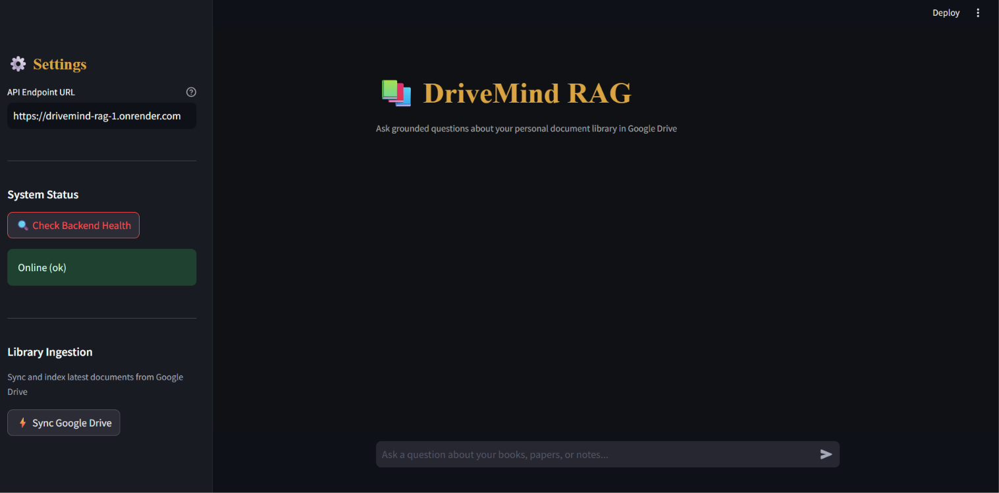
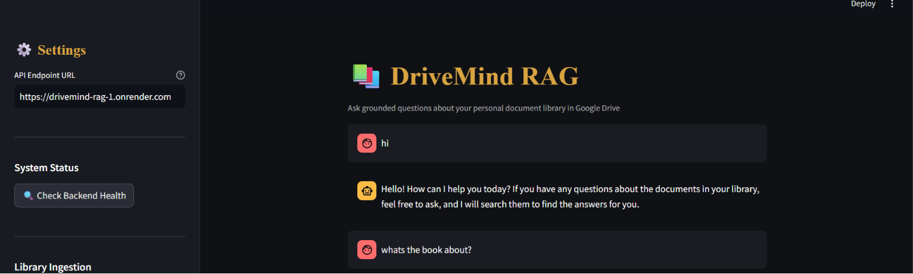

# 📚 DriveMind RAG — Personal Library AI Assistant

> **A 100% Free-Tier ($0/mo), Production-Ready Retrieval-Augmented Generation (RAG) System** that turns your Google Drive books, papers, and notes into an interactive, grounded AI knowledge base.

---

## 🖥️ Application UI Screenshots

<!-- Screenshot 1 Placeholder: Main Chat Interface -->


<br/>

<!-- Screenshot 2 Placeholder: Source Citations & Sidebar Ingestion -->


---

## 🌟 Why DriveMind RAG? (Novelty & Efficiency)

Building RAG applications often incurs expensive server costs, heavy memory footprints, and complex agent frameworks. **DriveMind RAG** was engineered from the ground up to solve these exact problems:

1. **$0/Month Cost Ceiling**: Runs entirely on free tiers—Google Gemini API (free tier), Qdrant Cloud (Free Forever cluster), Google Drive API, and Render Free Web Services.
2. **Zero Server RAM Memory Overhead**: Replaced heavy local embedding models (`sentence-transformers`/PyTorch ~400MB) with Google's `models/gemini-embedding-001` (3072-dim) via API. The app runs smoothly on 512MB RAM free containers without OOM crashes.
3. **Smart Request Batching (15 RPM Optimization)**: Automatically batches text chunk embeddings into single API calls, preventing rate-limit errors (429 Quota Exceeded) on Gemini's free tier.
4. **Lightweight & Async Execution**: Replaced heavy agent orchestration frameworks (like LangChain/LangGraph) with a clean, hand-rolled Gemini tool-use loop. Non-blocking background threadpools ensure immediate HTTP responses.

---

## 🏗️ Architecture & How It Works

```
[ Google Drive Folder ]
         │  (Download PDF / DOCX / GDOC / TXT / MD)
         ▼
[ Ingestion Pipeline ] ── Chunking ── Batch Embeddings ──► [ Qdrant Vector Cloud ]
                                                                   │
                                                      search_library tool call
                                                                   ▼
[ User ] ── Question ──► [ Streamlit UI / FastAPI ] ──► [ Gemini Agent Loop ]
                                                                   │
                                                                   ▼
                                                       [ Grounded Answer + Sources ]
```

1. **Ingestion (`POST /ingest`)**: Downloads documents from your Google Drive folder, splits text into overlapping chunks, computes 3072-dimensional Gemini embeddings, and upserts them into Qdrant Cloud.
2. **Agentic Search (`POST /chat`)**: When asked a question, Gemini automatically invokes the custom `search_library` tool, queries Qdrant Cloud for semantic matches, and synthesizes a grounded answer with direct Google Drive source links.

---

## 🚀 Completed Project Phases

- [x] **Phase 0 — Infrastructure Setup**: Environment configuration, Qdrant Cloud vector cluster creation, Google Cloud Service Account setup, and Gemini API integration.
- [x] **Phase 1 — Google Drive Connector**: Multi-format document parser supporting PDF, DOCX, Google Docs, TXT, and Markdown files.
- [x] **Phase 2 & 3 — Semantic Vector Search**: `RecursiveCharacterTextSplitter` chunking, 3072-dim Gemini embeddings, and Qdrant Cloud vector indexing.
- [x] **Phase 4 — Hand-Rolled RAG Agent**: Custom function-calling loop with `google-generativeai` SDK.
- [x] **Phase 5 — Production API Layer**: FastAPI web server providing `/health`, `/ingest`, and `/chat` endpoints.
- [x] **Phase 6 — Docker & Render Deployment**: Containerized deployment on Render with hardcoded port bindings and asynchronous threadpool request handling.
- [x] **Phase 7 — Streamlit Chat UI**: Dark-themed interactive web interface with source citation pills, sidebar health checks, and one-click Drive synchronization.

---

## 🛠️ Step-by-Step Setup Guide (For Outsiders)

### 1. Prerequisites & Free API Keys

Before running the project, collect your free-tier keys:
1. **Google Gemini API Key**: Get a free API key at [Google AI Studio](https://aistudio.google.com/).
2. **Qdrant Cloud Vector Store**: Create a free-forever cluster at [Qdrant Cloud](https://cloud.qdrant.io/). Obtain your `QDRANT_URL` and `QDRANT_API_KEY`.
3. **Google Service Account**:
   - Go to the [Google Cloud Console](https://console.cloud.google.com/).
   - Enable the **Google Drive API**.
   - Create a Service Account and download the JSON key.
   - Base64-encode your JSON key: `[Convert]::ToBase64String([IO.File]::ReadAllBytes("service_account.json"))` (PowerShell) or `base64 -w 0 service_account.json` (Linux).
   - Create a folder in Google Drive, and share it with your Service Account's email address.

---

### 2. Local Installation

```bash
# 1. Clone repository
git clone https://github.com/Kioshi-HAWW/DriveMind-RAG.git
cd DriveMind-RAG

# 2. Create and activate virtual environment
python -m venv .venv
# On Windows PowerShell:
.venv\Scripts\activate
# On Linux/macOS:
# source .venv/bin/activate

# 3. Install dependencies
pip install -r requirements.txt
```

---

### 3. Environment Configuration

Create a `.env` file in the root directory (see `.env.example`):

```env
GEMINI_API_KEY="your-gemini-api-key"
GEMINI_MODEL="gemini-1.5-flash"
QDRANT_URL="https://your-cluster.qdrant.tech"
QDRANT_API_KEY="your-qdrant-api-key"
QDRANT_COLLECTION_NAME="library"
GOOGLE_SERVICE_ACCOUNT_B64="your-base64-encoded-service-account-json"
GOOGLE_DRIVE_FOLDER_ID="your-google-drive-folder-id"
RETRIEVAL_TOP_K=5
```

---

### 4. Running the Application

#### Step A: Start the FastAPI Backend
```bash
uvicorn app.main:app --reload --port 8000
```
*API docs will be available at `http://localhost:8000/docs`.*

#### Step B: Launch the Streamlit Chat UI
In a separate terminal tab:
```bash
streamlit run streamlit_app.py
```
*The UI will open automatically at `http://localhost:8501`.*

---

## 📡 API Reference & Curl Examples

### 1. Health Check
```bash
curl -X GET http://localhost:8000/health
```
**Response:** `{"status": "ok"}`

### 2. Trigger Document Ingestion
```bash
curl -X POST http://localhost:8000/ingest \
  -H "Content-Type: application/json" \
  -d '{}'
```
**Response:** `{"status": "started", "message": "Ingestion running in background."}`

### 3. Send Question to RAG Agent
```bash
curl -X POST http://localhost:8000/chat \
  -H "Content-Type: application/json" \
  -d '{"message": "What are the main concepts in my library?"}'
```

---

## 🐳 Production Deployment (Render / Docker)

This repository includes a `Dockerfile` and `render.yaml` pre-configured for **Render Free Web Services**:

1. Fork/Push this repository to GitHub.
2. Log in to [Render](https://render.com/) and create a new **Web Service** from your repository.
3. Set the environment variables in the Render Dashboard (`GEMINI_API_KEY`, `QDRANT_URL`, etc.).
4. Render will automatically build the Docker container and expose the app on port `10000`.

---

## 📝 License

Distributed under the MIT License. See `LICENSE` for more information.
